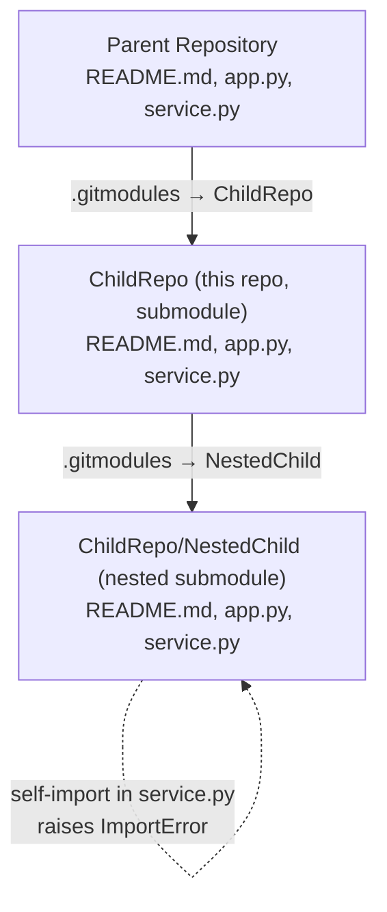
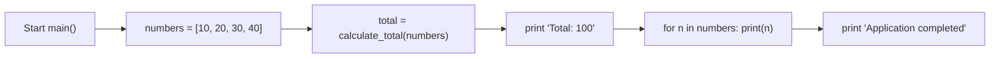

# ChildRepo — Modular Sum/Average Demo (Child Submodule)

## Overview

`ChildRepo` is a minimal, dependency-free Python demonstration of modular
arithmetic helpers (`service.py`) driven by a small console entry point
(`app.py`). Running the entry point computes and prints the sum of a fixed list
of numbers, then echoes each number and a completion message. The arithmetic
helpers and the console behavior are defined in the source modules
(`Source: ChildRepo/service.py:L1-L14`, `Source: ChildRepo/app.py:L1-L16`).

This repository is itself a **Git submodule of the parent repository**, and it in
turn **hosts its own nested submodule, `NestedChild`** — forming a three-level
chain: **parent → `ChildRepo` → `NestedChild`**. `Source: ChildRepo/.gitmodules`,
`Source: .gitmodules`.

---

## Repository Structure

`ChildRepo` occupies the middle level of a three-level submodule chain: the
parent repository includes it as a submodule, and it embeds `NestedChild` as its
own nested submodule. The diagram below also records the runtime defect at the
nested level (documented, not fixed — see
[Known Limitations / Troubleshooting](#known-limitations--troubleshooting)).
`Source: .gitmodules`, `Source: ChildRepo/.gitmodules`,
`Source: ChildRepo/NestedChild/service.py:L1-L16`.



### File / folder tree

```text
ChildRepo/
├── README.md          # This file — child submodule documentation
├── app.py             # Console entry point; defines main()
├── service.py         # Arithmetic helpers: calculate_total, calculate_average
├── large.csv          # Excluded from Blitzy viewing/documentation by .blitzyignore (*.csv); still tracked by Git
└── NestedChild/       # Nested Git submodule → 600K_Nested_ChildRepo
```

> **Note:** `NestedChild/` is a nested Git submodule; Git does not populate it on
> a plain `git clone` (see [Setup / Installation](#setup--installation)).
> `Source: Git SCM documentation, "Git Tools - Submodules" (https://git-scm.com/book/en/v2/Git-Tools-Submodules)`.
> The `*.csv` rule in `.blitzyignore` excludes `large.csv` from Blitzy viewing
> and documentation only; it does **not** ignore the file in Git or remove it
> from version control (the file remains Git-tracked). `Source: ChildRepo/.blitzyignore:1`.

### Submodules

The nested submodule wiring is declared in the `.gitmodules` file at this level.
`Source: ChildRepo/.gitmodules`.

| Submodule path | Repository URL                                                 |
|----------------|----------------------------------------------------------------|
| `NestedChild`  | `https://github.com/lakshya-blitzy/600K_Nested_ChildRepo.git`  |

For completeness, the parent repository declares this repository as a submodule
at `https://github.com/lakshya-blitzy/600K_ChildRepo.git`. `Source: .gitmodules`.

**Navigation:** Down into the nested submodule, see
[`./NestedChild/README.md`](./NestedChild/README.md); up to the parent
repository, see [`../README.md`](../README.md).

---

## Prerequisites

| Requirement           | Details                                                                                  |
|-----------------------|------------------------------------------------------------------------------------------|
| Python **>= 3.6**     | Required for the f-string formatting used by the entry point. `Source: ChildRepo/app.py:L8` |
| Git (submodule-aware) | Needed to clone and initialize the nested submodule repository. `Source: Git SCM documentation, "Git Tools - Submodules" (https://git-scm.com/book/en/v2/Git-Tools-Submodules)` |
| Third-party packages  | **None.** The project uses only the Python standard library; the repository tree contains no dependency manifest (no `requirements.txt`, `pyproject.toml`, or `setup.py`). `Source: repository file tree (see [Repository Structure](#repository-structure))` |

> **Verified interpreter:** The example output shown in
> [Usage / Running](#usage--running) was **verified on CPython 3.12.3**, the
> reference runtime pinned by the project's dependency inventory. Any Python
> **>= 3.6** satisfies the only language feature used — the f-string in
> `main()`. `Source: ChildRepo/app.py:L8`;
> `Source: verified runtime — CPython 3.12.3 (running "python app.py" prints "Total: 100", exit code 0)`.

---

## Setup / Installation

**Git does not download submodule contents by default.** If you clone without
initializing submodules, the `NestedChild/` directory will be **empty**. Use the
recursive workflow below so that every submodule — including the nested one — is
populated. The `--recurse-submodules` flag initializes and clones every submodule
recursively, which also covers the nested submodule.
`Source: Git SCM documentation, "Git Tools - Submodules" (https://git-scm.com/book/en/v2/Git-Tools-Submodules)`.
The submodule paths and URLs referenced here are declared in the `.gitmodules`
files. `Source: ChildRepo/.gitmodules`, `Source: .gitmodules`.

```bash
# Clone with all submodules (including nested) initialized
git clone --recurse-submodules <repository-url>

# Or, if already cloned without submodules, populate them:
git submodule update --init --recursive
```

> **Keeping submodules in sync:** Submodules do **not** auto-update when you pull
> parent-repository changes; you must update them manually to match the commit
> the parent references. After pulling the parent, re-run
> `git submodule update --init --recursive`.
> `Source: Git SCM documentation, "Git Tools - Submodules" (https://git-scm.com/book/en/v2/Git-Tools-Submodules)`.

---

## API Documentation

The child submodule exposes three functions across two modules. All signatures,
parameters, and return values below are transcribed directly from the source.
`Source: ChildRepo/service.py:L1-L14`, `Source: ChildRepo/app.py:L1-L16`.

| Function            | Signature                     | Returns                                                                    |
|---------------------|-------------------------------|----------------------------------------------------------------------------|
| `calculate_total`   | `calculate_total(numbers)`    | Sum of the list; `0` if empty. `Source: ChildRepo/service.py:L1-L7`        |
| `calculate_average` | `calculate_average(numbers)`  | `0` if falsey/empty; else sum/len (float). `Source: ChildRepo/service.py:L10-L14` |
| `main`              | `main()`                      | `None`; prints total, each number, and a completion line. `Source: ChildRepo/app.py:L3-L16` |

### `calculate_total(numbers)`

Sums a list of numbers using an accumulator that starts at `0`, returning the
running total. An empty list yields `0`. `Source: ChildRepo/service.py:L1-L7`.

| Parameter | Description                                    |
|-----------|------------------------------------------------|
| `numbers` | An iterable/list of numeric (`int`/`float`) values to sum. |

**Returns:** the arithmetic sum of all elements; `0` for an empty list.

```python
>>> from service import calculate_total
>>> calculate_total([10, 20, 30, 40])
100
>>> calculate_total([])
0
```

### `calculate_average(numbers)`

Returns `0` when `numbers` is falsey/empty; otherwise returns
`calculate_total(numbers) / len(numbers)`. Because Python's `/` operator
performs true division, a non-empty input produces a `float`.
`Source: ChildRepo/service.py:L10-L14`.

| Parameter | Description                                          |
|-----------|------------------------------------------------------|
| `numbers` | A list (or other **sized** iterable) of numeric (`int`/`float`) values to average. Because the implementation calls `len(numbers)`, unsized iterables such as generators are not supported. `Source: ChildRepo/service.py:L10-L14` |

**Returns:** `0` for a falsey/empty input; otherwise the mean as a `float`.

```python
>>> from service import calculate_average
>>> calculate_average([10, 20, 30, 40])
25.0
>>> calculate_average([])
0
```

### `main()`

The console entry point. It builds the fixed list `[10, 20, 30, 40]`, computes
the total via `calculate_total`, prints `Total: {total}`, prints each number on
its own line, and finally prints `Application completed`. It returns `None` and
is guarded by `if __name__ == "__main__":` so it runs only on direct execution.
`Source: ChildRepo/app.py:L3-L16`.

| Parameter | Description |
|-----------|-------------|
| *(none)*  | Takes no arguments. |

**Returns:** `None` (its effect is the text written to standard output).

```python
>>> import app
>>> app.main()
Total: 100
10
20
30
40
Application completed
```

---

## Usage / Running

Run the entry point from within the `ChildRepo` working tree:

```bash
python app.py
```

Expected output (deterministic — it follows directly from the source logic in `main()`, `Source: ChildRepo/app.py:L3-L16`):

```text
Total: 100
10
20
30
40
Application completed
```

The helper functions can also be used interactively:

```python
>>> from service import calculate_total, calculate_average
>>> calculate_total([10, 20, 30, 40])
100
>>> calculate_average([10, 20, 30, 40])
25.0
>>> calculate_total([])
0
>>> calculate_average([])
0
```

---

## Inline Code Explanation

A line-referenced walkthrough of both modules.

### `app.py`

- `ChildRepo/app.py:L1` — imports `calculate_total` from the local `service`
  module (only `calculate_total` is imported; `calculate_average` is not).
- `ChildRepo/app.py:L3` — defines the `main()` entry-point function.
- `ChildRepo/app.py:L4` — defines the fixed input list `[10, 20, 30, 40]`.
- `ChildRepo/app.py:L6` — computes the total via the `calculate_total` helper.
- `ChildRepo/app.py:L8` — prints `Total: {total}` using an f-string (requires Python >= 3.6).
- `ChildRepo/app.py:L10-L11` — loops over the list and prints each number on its own line.
- `ChildRepo/app.py:L13` — prints the literal `Application completed`.
- `ChildRepo/app.py:L15-L16` — the `__main__` guard runs `main()` only on direct execution.

### `service.py`

- `ChildRepo/service.py:L1-L7` — `calculate_total` initializes an accumulator to
  `0`, adds each element in a loop, and returns the running total (`0` for an
  empty list).
- `ChildRepo/service.py:L10-L14` — `calculate_average` guards against a
  falsey/empty input by returning `0`, otherwise returns
  `calculate_total(numbers) / len(numbers)` (true division → `float`).

### `main()` execution flow



---

## Deployment Guide

There is **no build or packaging system** for this project — no compilation
step, no bundler, and no package manifest. The **executable application**
consists of the two Python modules (`app.py` and `service.py`) and has no build
or package manifest; the wider repository tree additionally holds this README,
the `NestedChild/` nested submodule, and version-control/ignored files that are
not part of the runnable program.
`Source: repository file tree (see [Repository Structure](#repository-structure))`.
Deployment reduces to:

1. Place the repository directory on a host that has a Python **>= 3.6** runtime
   (required for the f-string in `main()`). The directory must contain a valid
   `service.py` providing `calculate_total`, because `app.py` imports it.
   `Source: ChildRepo/app.py:L1`, `Source: ChildRepo/app.py:L8`.
2. Run the entry point (the `__main__` guard invokes `main()` on direct
   execution):

   ```bash
   python app.py
   ```

   `Source: ChildRepo/app.py:L15-L16`.

There are **no environment variables, no configuration files, and no
command-line arguments**: neither module imports `os`, `sys`, `argparse`, or any
configuration reader, and `main()` takes no parameters. The only runtime input
is the hard-coded list inside `main()`.
`Source: ChildRepo/app.py:L1-L16`, `Source: ChildRepo/service.py:L1-L14`, `Source: ChildRepo/app.py:L4`.

---

## Known Limitations / Troubleshooting

The following are **documented, not fixed** — they describe the code as it
currently exists.

- **`calculate_average` is never called.** `app.py` imports only
  `calculate_total`, so `calculate_average` is defined but unused by the
  application. `Source: ChildRepo/app.py:L1`.
- **Code duplication across levels.** The parent and `ChildRepo` copies of
  `app.py`/`service.py` share **identical executable logic** — their
  non-docstring code is the same — while their repository-specific docstrings
  and `Source:` citations differ, so the full files are not byte-identical.
  `Source: ChildRepo/app.py:L1-L16`, `Source: app.py:L1-L16`.
- **Hard-coded input; no engineering safeguards.** The input is hard-coded as
  `[10, 20, 30, 40]`, and neither module adds input validation, error handling,
  logging, or type annotations.
  `Source: ChildRepo/app.py:L1-L16`, `Source: ChildRepo/service.py:L1-L14`. There
  is likewise no test suite or CI configuration anywhere in the project — the
  repository tree contains no test files or CI configuration.
  `Source: repository file tree (see [Repository Structure](#repository-structure))`.
- **Nested submodule caveat (broken).** The `NestedChild` submodule is broken:
  its `service.py` is a misplaced copy of `app.py` and performs a self-import
  `from service import calculate_total`, which raises `ImportError` at runtime.
  See [`./NestedChild/README.md`](./NestedChild/README.md) for full details and
  reproduction steps. `Source: ChildRepo/NestedChild/service.py:L1-L16`.

### Troubleshooting — empty submodule folder

If `NestedChild/` is empty after cloning (because the repository was cloned
without `--recurse-submodules`), populate the submodule with:

```bash
git submodule update --init --recursive
```
