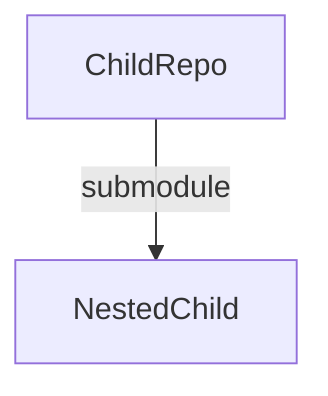
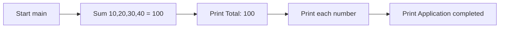

# 600K_ChildRepo

## Overview

`600K_ChildRepo` is a minimal, standard-library-only Python application that
demonstrates simple list summation. It builds a fixed list of integers, sums
them with a small reusable helper, and prints the total along with each input
value.

This repository is the **middle level** of a two-level Git submodule tree:

```text
600K_ParentRepo  →  ChildRepo  →  NestedChild
```

It is consumed as a submodule by the parent repository (`600K_ParentRepo`)
(`Source: .gitmodules` — the parent repository's `.gitmodules`, which declares
the parent → `ChildRepo` edge) and, in turn, embeds its own nested submodule,
`NestedChild` (`Source: ChildRepo/.gitmodules`, which declares the
`ChildRepo` → `NestedChild` edge). The repository deliberately mirrors the
parent repository's shape — the same two-file `app.py` / `service.py` layout —
so a reader moving between the parent, this child, and the nested repository
encounters a consistent structure.

- **Language:** Python 3.6+ (standard library only — no third-party
  dependencies; `Source: ChildRepo/service.py`, which has no imports).
- **Entry point:** `app.py` (`Source: ChildRepo/app.py:L16`).
- **Computation module:** `service.py` (`Source: ChildRepo/service.py:L18`).

> This is a **documentation-only** description of the code exactly as it exists
> today. No program logic is changed, and known defects (see
> [Known Issues](#known-issues)) are documented as-is rather than repaired.

## Table of Contents

- [Overview](#overview)
- [Prerequisites](#prerequisites)
- [Setup and Installation](#setup-and-installation)
- [Submodule Composition](#submodule-composition)
- [API Documentation](#api-documentation)
- [Deployment and How to Run](#deployment-and-how-to-run)
- [Inline Code Explanations](#inline-code-explanations)
- [Known Issues](#known-issues)

## Prerequisites

| Requirement | Details |
|-------------|---------|
| Python | **3.6+** (verified with Python 3.12.3). The code uses only f-strings and basic control flow, so any modern CPython 3.x works. |
| Git | Required to clone the repository and fetch its nested submodule recursively. |
| Third-party packages | **None.** The project depends solely on the Python standard library (`Source: ChildRepo/service.py`, no imports; `ChildRepo/app.py` imports only the intra-repository `service` module). |

## Setup and Installation

Because `ChildRepo` embeds the `NestedChild` submodule, it must be acquired
**recursively** so the nested repository is fetched as well
(`Source: ChildRepo/.gitmodules`).

**Fresh clone (recommended)** — clone and initialize every nested submodule in
one step:

```bash
git clone --recursive <repository-url>
```

**Existing checkout** — if the repository was already cloned without
`--recursive`, initialize and update the submodules afterward:

```bash
git submodule update --init --recursive
```

The `NestedChild` submodule is an integral part of this project. If it is not
fetched recursively, the `NestedChild/` directory will be empty and the nested
repository's files will be missing.

> **Security note:** clone using the clean repository URLs only. Never embed a
> personal access token in a URL that is committed or shared. The submodule URL
> recorded in `ChildRepo/.gitmodules` is the clean, token-free form shown in
> [Submodule Composition](#submodule-composition).

## Submodule Composition

`ChildRepo` contains exactly one submodule, `NestedChild`, declared in
`ChildRepo/.gitmodules` (`Source: ChildRepo/.gitmodules`):

| Submodule | Path | URL |
|-----------|------|-----|
| `NestedChild` | `NestedChild` | `https://github.com/lakshya-blitzy/600K_Nested_ChildRepo.git` |

Navigate down into the nested submodule's own documentation here:
[NestedChild](NestedChild/README.md).



Within the wider project, `ChildRepo` is itself a submodule of the parent
repository, making it the middle tier of the parent → `ChildRepo` →
`NestedChild` chain.

## API Documentation

This repository exposes three functions across two modules. `app.py` imports
`calculate_total` from the local `service` module
(`Source: ChildRepo/app.py:L14`) and orchestrates the run via `main()`;
`service.py` provides the pure numeric helpers.

The execution flow of `main()` is:



### `calculate_total(numbers)`

Iteratively sums the elements of a numeric iterable
(`Source: ChildRepo/service.py:L18`).

| Parameter | Type | Description |
|-----------|------|-------------|
| `numbers` | list of int/float (numeric iterable) | Values to sum. Elements are assumed to be numeric. |

**Returns:** `int` / `float` — the accumulated total of all elements. Returns
`0` for an empty iterable (the natural result of summing zero elements).

**Behavior:** walks the input a single time, adding each element to a running
accumulator, then returns the accumulator. It performs no I/O and does not
mutate its input.

```python
calculate_total([10, 20, 30, 40])  # -> 100
calculate_total([])                # -> 0
```

### `calculate_average(numbers)`

Computes the arithmetic mean of a numeric iterable
(`Source: ChildRepo/service.py:L44`).

| Parameter | Type | Description |
|-----------|------|-------------|
| `numbers` | list of int/float (numeric iterable) | Values to average. |

**Returns:** `int` / `float` — the total divided by the number of elements.
Returns `0` for empty or otherwise falsey input, which guards against division
by zero.

**Behavior:** delegates summation to `calculate_total` and divides by
`len(numbers)`.

> **Note:** `calculate_average` is **defined but never invoked** anywhere in
> the project (`Source: ChildRepo/service.py:L44`). It is documented here for
> completeness and full API coverage.

```python
calculate_average([10, 20, 30, 40])  # -> 25.0
calculate_average([])                # -> 0
```

### `main()`

Application entry point that sums a hard-coded list and prints the results
(`Source: ChildRepo/app.py:L16`).

| Parameter | Type | Description |
|-----------|------|-------------|
| _(none)_ | — | `main()` takes no arguments. |

**Returns:** `None` — all results are written to standard output.

**Behavior:** builds the fixed list `[10, 20, 30, 40]`, delegates the summation
to `calculate_total`, prints `Total: 100`, prints each number on its own line,
and finally prints `Application completed`.

```python
main()  # prints: "Total: 100", then 10, 20, 30, 40, then "Application completed"
```

## Deployment and How to Run

This is a standalone, standard-library-only script — there is **no container or
cloud deployment** and no build step. Run it directly with the Python
interpreter from inside the `ChildRepo` directory:

```bash
python app.py
```

> On systems where `python` resolves to Python 2, use `python3 app.py`. The
> program targets Python 3.6+.

Expected standard output (`Source: ChildRepo/app.py:L16`):

```text
Total: 100
10
20
30
40
Application completed
```

## Inline Code Explanations

- **Accumulation / summation loop (`Source: ChildRepo/service.py:L38-L39`).**
  Inside `calculate_total`, a `for number in numbers:` loop (line L38) adds each
  element into a running `total` with `total += number` (line L39). This single
  pass is the core of the summation; the function returns the accumulated
  `total` afterward.

- **`if __name__ == "__main__":` guard (`Source: ChildRepo/app.py:L47-L48`).**
  At the bottom of `app.py`, this guard calls `main()` **only** when the module
  is executed directly (for example, `python app.py`). When `app.py` is
  imported by another module, `main()` does not run, so importing the module
  produces no side effects.

- **`calculate_average` is defined but never called
  (`Source: ChildRepo/service.py:L44`).** The function is fully implemented and
  documented, but no code path in this repository invokes it (AAP §1.2.2). It
  is retained and documented here for API completeness.

## Known Issues

- **Nested submodule circular `ImportError` (documented as-is, not fixed).**
  In the nested submodule, `ChildRepo/NestedChild/service.py` and
  `ChildRepo/NestedChild/app.py` were **byte-for-byte identical at the
  pre-documentation baseline** — the nested repository's original
  `Create app.py` and `Create service.py` commits, before any docstrings or
  comments were added (established by comparing the two files' contents at that
  baseline revision, where they shared an identical checksum). Adding docstrings
  and comments during this documentation task has since made the two files differ
  textually, but their non-documentation statements and control flow remain
  equivalent. Because of that original duplication, `service.py` defines `main()`
  (`Source: ChildRepo/NestedChild/service.py:L43`) and imports `calculate_total`
  from `service` (`Source: ChildRepo/NestedChild/service.py:L41`) instead of
  *defining* `calculate_total` / `calculate_average`. Since `service.py` ends up
  importing a name from itself — the same `from service import calculate_total`
  statement that `app.py` uses (`Source: ChildRepo/NestedChild/app.py:L44`) —
  running `ChildRepo/NestedChild/app.py` raises a circular-import `ImportError`
  at runtime and exits with a non-zero status (exit code 1). This is verified by
  executing `python3 app.py` in the `NestedChild` directory on Python 3.13.7,
  which fails at import time with empty standard output.

  On Python 3.13.7 the exact message (absolute path elided as `<path>`) is:

  ```text
  ImportError: cannot import name 'calculate_total' from 'service' (consider renaming '<path>/service.py' if it has the same name as a library you intended to import)
  ```

  The exact trailing parenthetical is CPython-version-dependent: Python 3.13.x
  emits the "consider renaming …" hint shown above, while other CPython versions
  emit the classic `... from partially initialized module 'service' (most likely
  due to a circular import)` form.

  This is a **documentation-only** task, so the defect is recorded rather than
  repaired. Full documentation of this issue — including the complete failure
  path and the canonical error message — lives in the `NestedChild` submodule's
  own **completed** README at
  [NestedChild/README.md](NestedChild/README.md), also linked above in
  [Submodule Composition](#submodule-composition).

- **`ChildRepo` itself runs correctly.** By contrast with the nested
  submodule, this repository's own `app.py` and `service.py` execute without
  error and produce the output shown in
  [Deployment and How to Run](#deployment-and-how-to-run).
