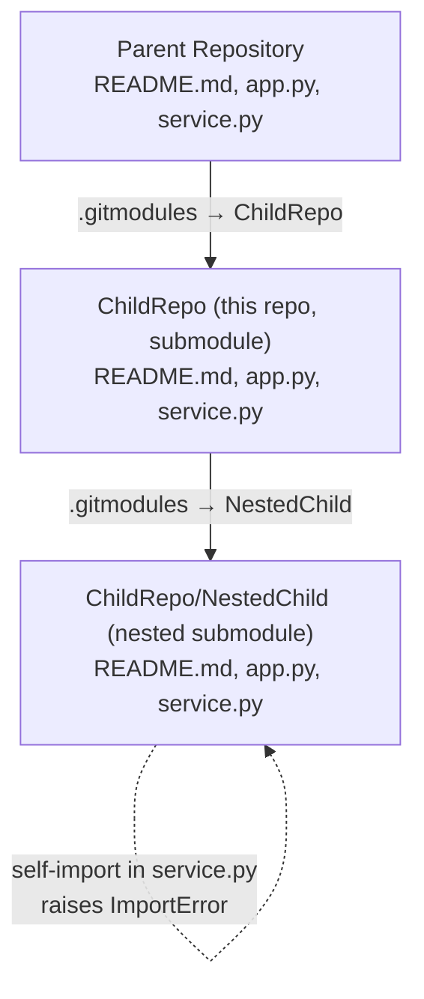
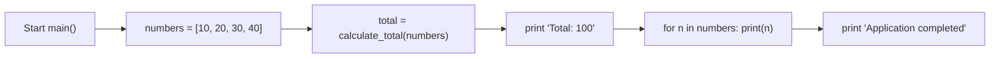

# ChildRepo — Modular Sum/Average Demo (Child Submodule)

## 1. Overview

`ChildRepo` is a minimal, dependency-free Python demonstration of two modular arithmetic helpers — `calculate_total` and `calculate_average`, defined in `service.py` — driven by a small console entry point in `app.py`. Running the entry point sums a fixed list of numbers and prints the total, then each number, then a completion message. `Source: ChildRepo/app.py:L1-L16`, `Source: ChildRepo/service.py:L1-L14`.

This repository is itself a **Git submodule of the parent repository**, and it in turn **hosts its own nested submodule, `NestedChild`** — forming a three-level chain: **parent → `ChildRepo` → `NestedChild`**. `Source: ChildRepo/.gitmodules`, `Source: .gitmodules`.

## 2. Repository Structure

`ChildRepo` occupies the middle level of a three-level submodule chain: the parent repository includes it as a submodule, and it embeds `NestedChild` as its own nested submodule. The diagram below also records the runtime defect at the nested level (documented, not fixed).



File and folder layout at this level:

```text
ChildRepo/
├── README.md      # This file
├── app.py         # Console entry point (defines main())
├── service.py     # Arithmetic helpers (calculate_total, calculate_average)
└── NestedChild/   # Nested Git submodule (populated only after recursive init)
```

> Note: a `large.csv` data file also exists at this level but is intentionally excluded from version control and documentation via `.blitzyignore` (`*.csv`); it is not part of the application.

Nested submodule wiring — `Source: ChildRepo/.gitmodules`:

| Submodule path | URL |
|----------------|-----|
| `NestedChild` | `https://github.com/lakshya-blitzy/600K_Nested_ChildRepo.git` |

For completeness, the parent repository declares this repository as a submodule at `https://github.com/lakshya-blitzy/600K_ChildRepo.git`. `Source: .gitmodules`.

**Navigation:**

- Down into the nested submodule: [`./NestedChild/README.md`](./NestedChild/README.md)
- Up to the parent repository: [`../README.md`](../README.md)

## 3. Prerequisites

- **Python ≥ 3.6** — required because `app.py` formats its output with an f-string. `Source: ChildRepo/app.py:L8`. The documentation examples were verified on **CPython 3.12.3**.
- **Git** with submodule support — required to clone and initialize the nested `NestedChild` repository. `Source: ChildRepo/.gitmodules`.
- **No third-party packages** — the project uses only the Python standard library; there is no `requirements.txt`, `pyproject.toml`, or `setup.py`, nor any other dependency manifest. `Source: ChildRepo/service.py:L1-L14`.

## 4. Setup / Installation

Git **does not download submodule contents by default**. If you clone this repository without initializing submodules, the `NestedChild/` directory will be empty. Use the recursive workflow below so that every submodule — including the nested one — is populated. `Source: ChildRepo/.gitmodules`.

```bash
# Clone with all submodules (including nested) initialized
git clone --recurse-submodules <repository-url>

# Or, if already cloned without submodules, populate them:
git submodule update --init --recursive
```

Submodules do **not** update automatically when you pull changes into the parent repository. After pulling parent updates, re-run `git submodule update --init --recursive` to align the submodule working trees with the commits the parent references.

## 5. API Documentation

The child submodule exposes three functions across two modules. Signatures and semantics are transcribed directly from the source.

| Function | Signature | Parameters | Returns |
|----------|-----------|------------|---------|
| `calculate_total` | `calculate_total(numbers)` | `numbers`: a list of `int`/`float` values to sum | The arithmetic sum of the list; `0` for an empty list. `Source: ChildRepo/service.py:L1-L7` |
| `calculate_average` | `calculate_average(numbers)` | `numbers`: a list of `int`/`float` values | `0` for a falsey/empty input; otherwise `calculate_total(numbers) / len(numbers)` (true division → `float`). `Source: ChildRepo/service.py:L10-L14` |
| `main` | `main()` | None | `None`; prints the total, then each number, then a completion line to standard output. `Source: ChildRepo/app.py:L3-L16` |

Exact semantics:

- `calculate_total([])` → `0` and `calculate_average([])` → `0`; the empty-input guard in `calculate_average` prevents a division-by-zero. `Source: ChildRepo/service.py:L1-L14`.
- `calculate_average([10, 20, 30, 40])` → `25.0` — a `float`, because Python's `/` performs true division. `Source: ChildRepo/service.py:L10-L14`.

## 6. Usage / Running

Run the entry point from within the `ChildRepo` working tree:

```bash
python app.py
```

Expected output (verified on CPython 3.12.3) — `Source: ChildRepo/app.py:L3-L16`:

```text
Total: 100
10
20
30
40
Application completed
```

You can also call the helpers directly from an interactive session:

```python
>>> from service import calculate_total, calculate_average
>>> calculate_total([10, 20, 30, 40])
100
>>> calculate_average([10, 20, 30, 40])
25.0
>>> calculate_total([])
0
>>> calculate_average([])
0
```

## 7. Inline Code Explanation

`app.py` — console entry point:

- `ChildRepo/app.py:L1` — imports `calculate_total` from the local `service` module (only this helper is imported).
- `ChildRepo/app.py:L4` — defines the fixed input list `[10, 20, 30, 40]`.
- `ChildRepo/app.py:L6` — computes the total by delegating to the `calculate_total` helper.
- `ChildRepo/app.py:L8` — prints `Total: {total}` using an f-string (this f-string is why Python ≥ 3.6 is required).
- `ChildRepo/app.py:L10-L11` — loops over the list and prints each number on its own line.
- `ChildRepo/app.py:L13` — prints the literal `Application completed`.
- `ChildRepo/app.py:L15-L16` — the `if __name__ == "__main__":` guard runs `main()` only when the file is executed directly.

`service.py` — arithmetic helpers:

- `ChildRepo/service.py:L1-L7` — `calculate_total` initializes an accumulator at `0` and adds each element in a loop, returning the running sum (hence `0` for an empty list).
- `ChildRepo/service.py:L10-L14` — `calculate_average` first guards against a falsey/empty input by returning `0`, then divides the total by the element count for a non-empty input.

Execution flow of `main()` — `Source: ChildRepo/app.py:L3-L16`:



## 8. Deployment Guide

There is **no build or packaging system** — no compilation step, no artifact bundling, and no dependency installation. Deployment reduces to the following:

1. Place the repository directory (which must contain a valid `service.py` alongside `app.py`) on a host with a **Python ≥ 3.6** runtime. `Source: ChildRepo/app.py:L1`.
2. Run `python app.py` from that directory. `Source: ChildRepo/app.py:L15-L16`.

The application takes **no environment variables, no configuration files, and no command-line arguments**; its only input is the hard-coded list inside `main()`. `Source: ChildRepo/app.py:L4`.

## 9. Known Limitations / Troubleshooting

The following items are **documented, not fixed** (this is a documentation-only effort — executable logic is unchanged):

- **`calculate_average` is defined but never called.** `app.py` imports only `calculate_total`, so the averaging helper is unreachable through the entry point. `Source: ChildRepo/app.py:L1`.
- **Byte-identical code duplication with the parent.** The `app.py` and `service.py` modules in this submodule duplicate the parent repository's versions — their executable code is byte-identical (code duplication). `Source: ChildRepo/app.py:L1-L16`.
- **Hard-coded input and no engineering scaffolding.** The input list `[10, 20, 30, 40]` is hard-coded in `main()`, and there is no input validation, error handling, logging, type annotations, test suite, or CI configuration anywhere in the project. `Source: ChildRepo/app.py:L3-L16`.
- **⚠️ Nested submodule is broken (`ImportError`).** The nested `NestedChild` submodule does not run: its `service.py` is a misplaced copy of `app.py` that performs a self-import `from service import calculate_total`, which raises `ImportError` at runtime. See [`./NestedChild/README.md`](./NestedChild/README.md) for full details and reproduction steps. `Source: ChildRepo/NestedChild/service.py:L1-L16`.

**Troubleshooting — empty `NestedChild/` directory.** If the `NestedChild/` folder is empty after cloning, the submodule was not initialized. Populate it with:

```bash
git submodule update --init --recursive
```
